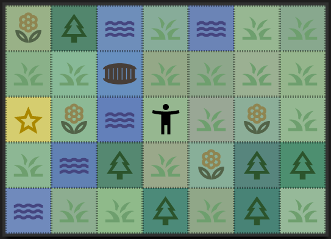
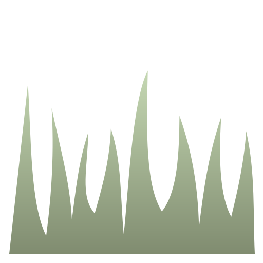
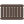

### MAP

Die Karte besteht aus quadratichen Kacheln, die Biome genannt werden. Sie haben eine Hintergrundfarbe und ein Symbol im SVG-Format. Diese Symbole haben maximal zwei Volltonfarben. Kacheln die in dieser Liste mit einem <b>X</b> makiert sind, sind undurchdrinbar und meist als Kartenrand oder Abgrenzung gedacht. Es gibt noch Varianten die den gleichen Hintergund, aber ein anderes Symbol besitzten. Dort befinden sich andere Ereignisse.
(Jede Kachel hat bis zu drei aktive Ereignisse die je bis zu drei aktive Aktionen haben)

Die Hintergrundfarbe wird mithilfe einer Funktion random leicht verändert, um die Karte lebendiger zu gestalten. Die Farben der Symbole lassen sich zur Zeit nicht per Code verändern und sind fix (Hardcodiert)

### Naturboden

 
<b>Wiese</b>   

 
<b>Feld</b>  

 <b>Blumenwiese</b> 
 <b>Gebäude</b> 

### Wald

 
<b>Tannenwald</b>   

X

 
<b>Dichter Tannenwald</b>  

 
<b>Laubwand</b>  

X

 
<b>Dichter Laubwand</b>  

### Wasser

x

 
<b>Tiefes Wasser</b>  

X

 
<b>Fluss</b>   

 
<b>Flaches Wasser</b>  

 <b>Brücke Vertikal</b> 
 <b>Brücke Horizontal</b> 

### Stein

 
<b>Sand</b>  

 
<b>Gestein</b>  

X

 
<b>Gebirge</b>  

X

 
<b>Steinwände</b>  

X

 
<b>Klippen</b>  

 <b>Höhle</b> 

### Element

 
<b>Schnee</b>  

### Bauwerk

X

 
<b>Holzwände</b>  

 
<b>Holzboden</b>  
