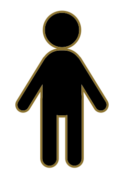
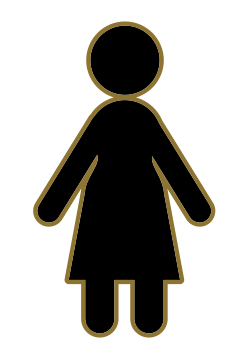
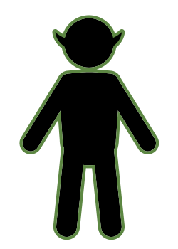
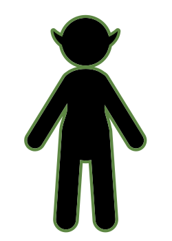

### Player

Die Figur des Players hat außer dem Namen, eine Rasse, ein Geschlecht und einen Hintergrund.
Mit dem Hintergrund ist das gemeint was in anderen Spielen die Klasse ist.
Hier bestimmt es nur die Anfangswerte und die Startausrüstung.

| Rasse  | Geschlecht | Items          | Ausgerüstet | STR | STA | INT | DEF | LUC | HP  |
| ------ | ---------- | -------------- | ----------- | --- | --- | --- | --- | --- | --- |
| Mensch | M/W        | Brot           | Leinenhemd  | +1  | +1  | +2  | +1  | +1  | 25  |
| Elf    | M/W        | Kartoffelsamen | Lederweste  | 0   | +3  | +1  | 0   | +2  | 25  |
| Zwerd  | M/W        | Spitzhacke     | Kettenhemd  | +3  | +1  | 0   | +2  | 0   | 25  |

| Hintergrund | Items    | Ausgerüstet | STR | STA | INT | DEF | LUC |
| ----------- | -------- | ----------- | --- | --- | --- | --- | --- |
| Krieger     | Eisenerz | Schwert     | +2  | 0   | 0   | +1  | 0   |
| Jäger       | Wasser   | Bogen       | 0   | +2  | 0   | 0   | +1  |
| Magier      | Buch     | Stab        | 0   | 0   | +2  | 0   | +1  |

<table>
    <tr>
        <td>
            

            Menschen 
                
                
            

        </td>
        <td>
            

            Elfen  
                
                
            

        </td>
        <td>
            

            Zwerge 
                
                
            

        </td>
    </tr>
</table>

### Attribute

#### Primärattribute

<b>STR: </b> - Die Stärke. Bestimmt die Effiktivität normaler Angriffe und Blocken. 
<b>STA: </b> - Die Geschicklichkeit. Bestimmt die Effiktivität bei Fernkampf und Ausweichen. 
<b>INT: </b> - Die Inteligens. Bestimmt die Effiktivität von Zauber und Wahrnehmung. 
<b>DEF: </b> - Die Verteidigung. Bestimmt wieviel Schaden durch kommt. 
<b>HP: </b> - Die Gesundheit. Bestimmt wievele Treffer der Charakter einstecken kann. 

#### Secundattribute

<b>BLO: </b> - Blocken. Verringert den Schaden der durch kommt 
<b>AUS: </b> - Ausweichen. Kann den Schaden komplett vermeiden 
<b>WAR: </b> - Wahrnehmung. In der Welt kommen Ereignisse öfter vor 
<b>KRIT: </b> - Kritisch. Schaden kann verdoppelt werden 
<b>LUC: </b> - Glück. Wird auf Zufallswerte zum Positiven addiert. 

### Buff und Debuff

<b>+ Regeneration: </b> - Über Zeit (Runden) wird die HP wieder hergestellt. 
<b>+ Glückssträhne: </b> - Über Zeit (Runden) gelingt dem Betroffenen das Ausweichen besser. 
<b>+ Beserker: </b> - Über Zeit (Runden) kann der Betroffene zu x% zweimal angreifen. 
<b>+ Schutzengel: </b> - Über Zeit (Runden) überlebt der Betroffene einen Todesstoß mit 1HP. 

<b>- Vergiftung: </b> - Über Zeit (Runden) verliert der Betroffene HP. 
<b>- Verwirrung: </b> - Über Zeit (Runden) könnte der Betroffene zu x% sich selbst verletzten. 
<b>- Geblendet: </b> - Über Zeit (Runden) gehen die Angriffe des Betroffenen zu x% daneben. 
<b>- Verletzt: </b> - Über Zeit (Runden) setzt der Betroffene zu x% die Runde aus. 

### Map-Fähigkeiten

<b>Schwimmen: </b> - Gesperrte Wasserkacheln können nun überquerrt werden. 
<b>Klettern: </b> - Gesperrte Wände können nun überquerrt werden. 
<b>Springen: </b> - Eine Kachel kann übersprungen werden. 
<b>Schleichen: </b> - Die meisten Kreaturen greifen nicht mehr automatisch an. 
<b>Durchdringen: </b> - Gesperrte Wälder können nun überquerrt werden. 
